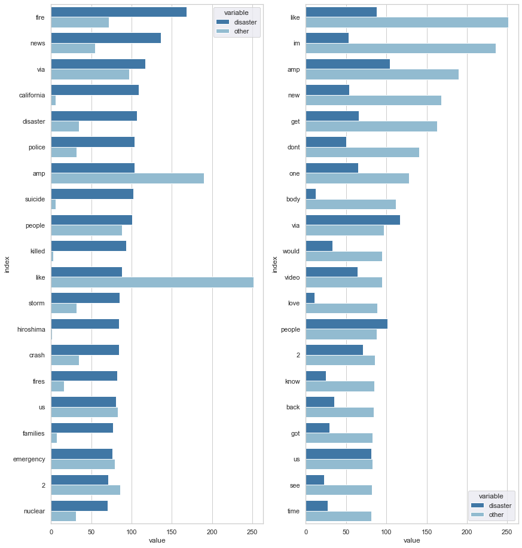
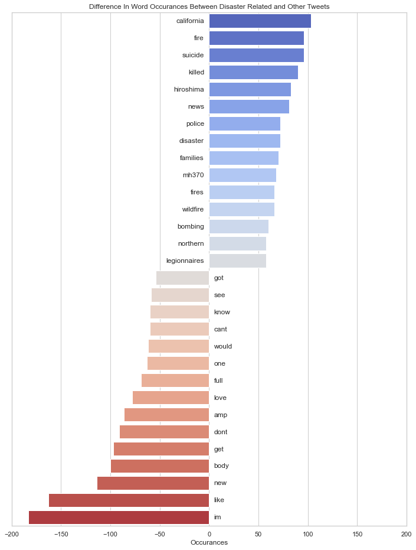

# Disaster Tweets NLP Project

## Purpose

The purpose of this project was to explore NLP concepts and apply them to a data set. The data was found on
[kaggle](https://www.kaggle.com/c/nlp-getting-started) and the goal of the project was to analyse the tweets to classify the topic,
i.e whether the tweet was about a natural disaster or not. I trained a multinomial Naive Bayes model that had an accuracy of 0.80.

## Data

The data came in csv files and was already split into a training and testing set. The training set had 7613 entries, while the test
set contained just under half this number of entries. The columns consisted of an id, a keyword, a location and the text from the tweet.

## Process

### EDA

Firstly, I analysed the words that each tweet contained by looking at the most used words in each topic category. This gave me an
interesting insight into what language twitter users used to discuss disasters. I found that tweets about disasters didn't use the same 
words as much as other tweets and the most commonly used words seemed to be locations or words that could be used to describe the disaster.

Then I looked into the words that had the largest difference in frequency between the two categories of tweets.

I thought these words would probably provide the biggest source of variance between the two topics and so be most useful to the Naive Bayes model.
